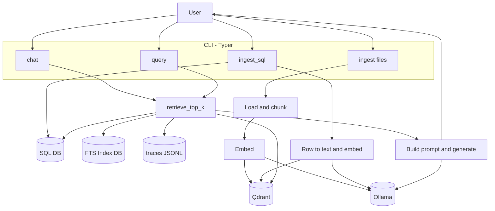
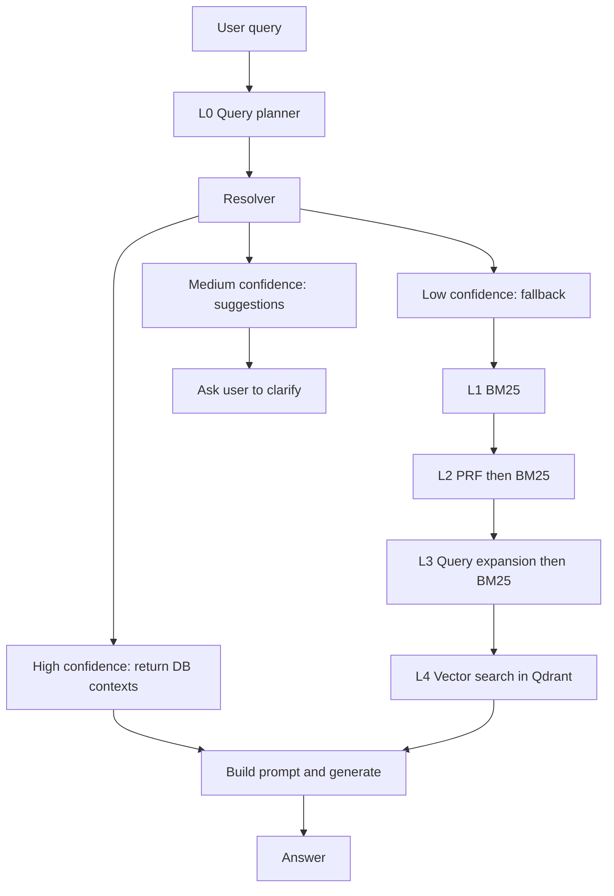
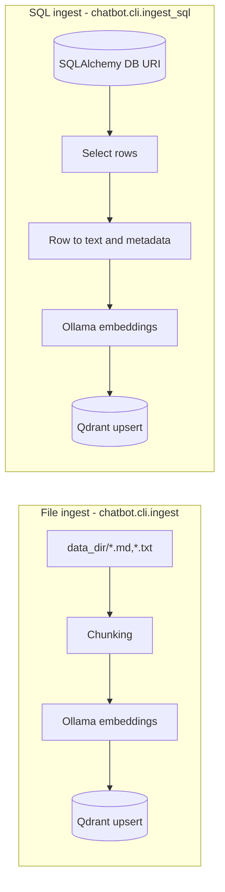

## Repo report + workflow diagrams (up to date)

This repo is a **CLI-first RAG backend** that supports:

- **Ingest**: files (`.md`/`.txt`) and SQL rows → embeddings (Ollama) → vectors in Qdrant
- **Query / Chat**: a multi-layer retrieval pipeline (planner + lexical + vector) → prompt → generation (Ollama)

Primary code lives in `src/chatbot/`.

---

### Repo map (what lives where)

- **CLI entrypoints** (`Typer`)
  - `src/chatbot/cli/ingest.py`: file ingest (data dir → chunk → embed → upsert)
  - `src/chatbot/cli/ingest_sql.py`: SQL ingest (rows → row_to_text → embed → upsert)
  - `src/chatbot/cli/query.py`: one-shot RAG query (retrieve → prompt → generate)
  - `src/chatbot/cli/chat.py`: REPL chat loop (retrieve → prompt → generate) with UX branches
- **RAG orchestration**
  - `src/chatbot/rag/pipeline.py`: prompt builder and `rag_answer()`
- **Retrieval stack**
  - `src/chatbot/retrieval/retriever.py`: `retrieve_top_k()` (the core retrieval ladder)
  - `src/chatbot/retrieval/query_planner.py`: LLM planner → strict JSON plan → deterministic normalization
  - `src/chatbot/retrieval/entity_resolver.py`: SQLite FTS5 + RapidFuzz resolver (+ FTS index builder)
  - `src/chatbot/retrieval/bm25.py`, `prf.py`, `query_expansion.py`: lexical fallback layers (L1–L3)
  - `src/chatbot/retrieval/normalize.py`: deterministic query normalization utilities (used by planner/resolver)
- **Vector store**
  - `src/chatbot/vectorstore/qdrant_store.py`: Qdrant upsert/search wrapper (with REST fallback)
- **Model integrations**
  - `src/chatbot/embeddings/ollama.py`: `/api/embeddings`
  - `src/chatbot/llm/ollama_chat.py`: `/api/generate`
- **SQL adapters (for ingest + lexical contexts)**
  - `src/chatbot/sql/reader.py`, `row_to_doc.py`
- **Observability**
  - `src/chatbot/observability/metrics.py`: writes per-query metrics JSONL into `./traces/`
  - `src/chatbot/observability/writer.py`: trace writer
- **Utility / scripts**
  - `Makefile`: common commands (`make install`, `make chat`, `make query`, `make ingest`, `make ingest-sql`)
  - `chatbot` (root): convenience wrapper for `python -m chatbot.cli.chat`
  - `reingest_chinook.py`, `reingest_chinook_mysql.py`: sample DB ingestion helpers
  - `eval/`: offline retrieval evaluation for BM25/PRF/QExp
  - `tests/`: connectivity checks + retrieval/resolver unit tests

---

### Architecture layers (runtime)

This is the **current, in-code layering** from “user input” to “answer”.

- **L-1 Interface**
  - CLI (`Typer`) commands: `chat`, `query`, `ingest`, `ingest_sql`
- **L0 Planning**
  - `plan_query()` uses Ollama (chat model) to emit a **strict JSON plan**:
    - intent (`entity_lookup|semantic|mixed`)
    - lexical query + vector query
    - preferred tables + filter hints (e.g. `{"table": ["Track"]}`)
  - On any failure: deterministic fallback plan + deterministic post-processing normalization
- **Lexical resolution (entity resolver)**
  - `resolve_entity()` uses a separate SQLite **FTS5 index DB** (derived as `*_fts.sqlite`)
  - Candidate retrieval by FTS `MATCH` (phrase + fallback queries) + fuzzy reranking (RapidFuzz)
  - Decisions:
    - **high**: fetch row(s) from SQL DB and return row-to-text contexts (skips Qdrant)
    - **medium**: return “Did you mean…?” suggestions (chat CLI shows suggestions and stops)
    - **low**: proceed to fallback retrieval and/or Qdrant
- **L1–L3 Lexical fallback layers (when resolver is low)**
  - L1: BM25
  - L2: PRF (pseudo relevance feedback) + BM25
  - L3: deterministic query expansion + BM25
- **L4 Vector retrieval**
  - Embed selected query text via Ollama embeddings
  - Qdrant search with optional `table` payload filter (from planner)
- **Generation (RAG)**
  - Build prompt with retrieved contexts and call Ollama generate
  - Chat CLI has extra UX behavior for “medium resolver” and “low-with-qdrant” cases
- **Observability**
  - `MetricsRecorder` records per-level timings (L0–L4) and writes to `./traces/`

Notes on “layers present but not wired”:

- `src/chatbot/cache/tiered_cache.py` exists but is **not currently used** in retrieval/ingest.
- Feature flags `ENABLE_BM25_LAYER`, `ENABLE_PRF_LAYER`, `ENABLE_QEXP_LAYER` exist in `config.py` but are **not currently checked** inside `retrieve_top_k()` (L1–L3 run unconditionally when reached).

---

### Workflow diagram (system overview)

---

### Workflow diagram (query/chat retrieval ladder: L0 → L4)

This diagram matches `src/chatbot/retrieval/retriever.py` and `src/chatbot/cli/chat.py`.

---

### Workflow diagram (ingest)

---

### Runtime configuration (env)

All config is loaded via `.env` / environment variables in `src/chatbot/config.py`.

- **Qdrant**: `QDRANT_URL`, `QDRANT_API_KEY`, `QDRANT_COLLECTION`
- **Ollama**: `OLLAMA_BASE_URL`, `EMBED_MODEL`, `CHAT_MODEL`
- **Retrieval**: `TOP_K`, `ENABLE_QUERY_PLANNER`, `ENABLE_LEGACY_TRAILING_TRIM`
- **SQL ingest / resolver**: `DB_URI`, `SQL_TABLE`, `SQL_UPDATED_AT`, `SQL_PK`
- **Observability**: `OBS_METRICS_ENABLED`, `SLA_P95_LATENCY_MS`

---

### How to “read” a query execution

If you run `chat` or `query` with `--debug`, you’ll typically see:

- **QUERY_PLAN**: the normalized plan output of L0
- **Resolver logs**: FTS candidates and a decision (high/medium/low)
- **Fallback logs**: whether BM25/PRF/QExp returned hits
- **Qdrant logs**: exact embedded text + optional filters + top results

Metrics are written as JSONL into `./traces/` when `OBS_METRICS_ENABLED=true`.

